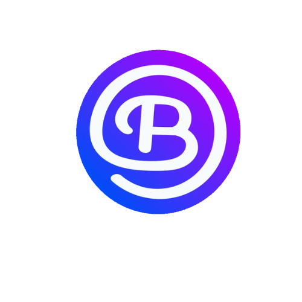
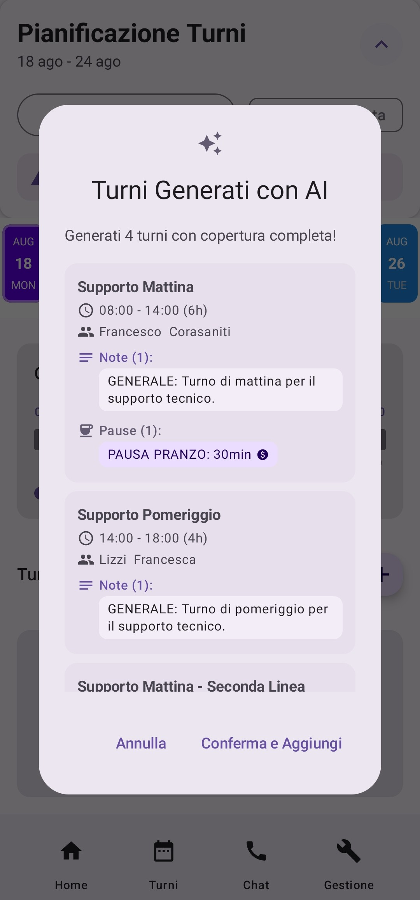
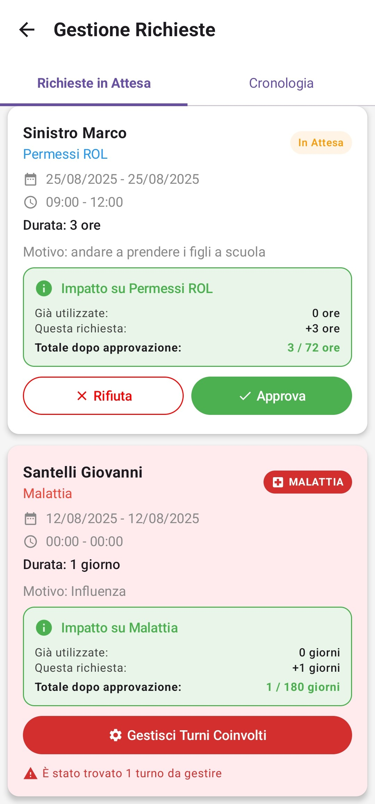
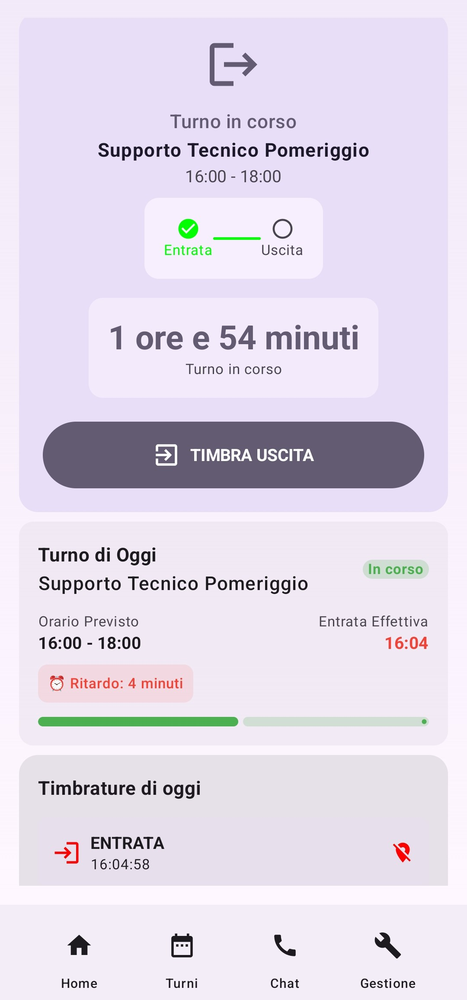
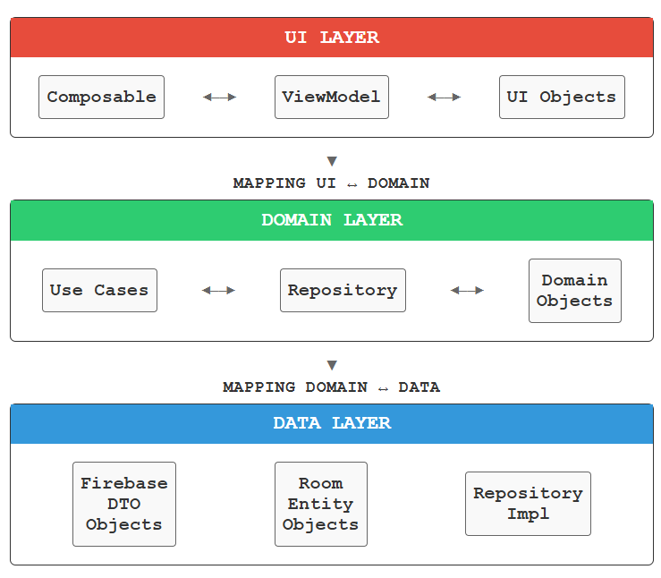

<p align="center">
  
</p>

<h1 align="center">BizSync</h1>

<p align="center">
  An Android workforce-management prototype for coordinating people, shifts, absences, and attendance.
</p>

<p align="center">
  
  
  
  
</p>

> [!IMPORTANT]
> **Project status — Archived.** BizSync was developed as a Bachelor's degree thesis project and is preserved as an academic snapshot. It is not under active development and should not be considered production-ready.

## Overview

BizSync explores how a single mobile application can support the daily workforce-management needs of small and medium-sized organizations. It provides role-specific experiences for managers and employees, with a particular focus on weekly scheduling, absence handling, attendance tracking, and reliable synchronization between local and remote data.

The prototype is written in Kotlin, uses Jetpack Compose for its interface, and follows a modular Clean Architecture approach. Firebase provides authentication and remote services, while Room supports local persistence.

## Product walkthrough

Managers configure their organization, departments, employees, and contracts before preparing the weekly schedule. Shifts can be created manually, reused from frequent patterns, or generated with AI assistance. Validation rules help identify employee conflicts and coverage gaps before a schedule is published.

Once the schedule is available, employees can review their shifts, submit absence requests, communicate with colleagues, and clock in or out. Attendance events can be checked against the assigned shift, time tolerance, and workplace location. Local Room data is synchronized with Firebase through dedicated orchestration and hash-based change detection.

<table>
  <tr>
    <td align="center">
      
    </td>
    <td align="center">
      
    </td>
    <td align="center">
      
    </td>
  </tr>
  <tr>
    <td align="center"><strong>AI-assisted scheduling</strong></td>
    <td align="center"><strong>Absence management</strong></td>
    <td align="center"><strong>Attendance tracking</strong></td>
  </tr>
</table>

<p align="center"><sub>The archived prototype interface is in Italian and the screenshots contain demonstration data.</sub></p>

## Key capabilities

### Manager experience

- Company, department, employee, contract, and invitation management
- Weekly shift planning with draft and publication states
- Manual, frequent-pattern, and AI-assisted shift creation
- Availability, overlap, and department-coverage checks
- Absence-request review with allowance impact and affected-shift handling
- Attendance, operational status, and report views

### Employee experience

- Personal schedule and upcoming-shift overview
- Absence and leave requests
- Clock-in and clock-out with timing and location validation
- Virtual employee badge with QR-code support
- Invitations, colleague information, and in-app chat

### Data and platform

- Firebase Authentication and Cloud Firestore integration
- Room-backed local cache
- Local/remote synchronization coordinated by dedicated orchestrators
- Dependency injection with Hilt
- Role-aware navigation built with Jetpack Compose

## Architecture

BizSync separates presentation, business rules, persistence, remote access, and synchronization into independent Gradle modules. UI models and Firebase/Room representations are mapped to domain objects at their respective boundaries.

<p align="center">
  
</p>

| Module | Responsibility |
| --- | --- |
| `app` | Android entry point, application composition, and Hilt dependency wiring |
| `ui` | Compose screens and components, navigation, UI models, and ViewModels |
| `domain` | Business models, repository contracts, validation logic, and use cases |
| `backend` | Firebase data sources, DTOs, mappers, repository implementations, and AI prompts |
| `cache` | Room database, entities, DAOs, converters, and local repository implementations |
| `sync` | Cache/remote orchestration, synchronization policies, and change hashes |

The primary data flow is:

```text
Compose UI → ViewModel → Domain use case → Repository contract
                                         ↙                   ↘
                               Room local cache        Firebase services
                                         ↘                   ↙
                                      Sync orchestration
```

## Technology stack

- Kotlin and Kotlin coroutines
- Jetpack Compose, Material 3, and Navigation Compose
- Hilt
- Room
- Firebase Authentication, Firestore, App Check, Analytics, Messaging, and Firebase AI
- Gradle Kotlin DSL
- ZXing for QR-code support
- Google Play Services Location

## Project structure

```text
bizsync/
├── app/                  # Application entry point and dependency injection
├── backend/              # Firebase and remote-data implementations
├── cache/                # Room persistence
├── domain/               # Business models, contracts, and use cases
├── sync/                 # Local/remote synchronization
├── ui/                   # Compose interface and presentation logic
├── docs/images/          # README diagrams and application screenshots
└── gradle/               # Version catalog and Gradle wrapper
```

## Getting started

### Requirements

- Android Studio with support for the project's Android Gradle Plugin
- JDK 11
- Android SDK 35
- An Android emulator or device running Android 8.0 (API 26) or later
- A Firebase project configured for the application ID `com.bizsync.app`

### Setup

1. Clone the repository:

   ```bash
   git clone https://github.com/GiuseppeRudi/bizsync.git
   cd bizsync
   ```

2. Open the project in Android Studio and let Gradle synchronize the modules.

3. Register an Android application with the ID `com.bizsync.app` in Firebase.

4. Download the Firebase configuration file and place it at:

   ```text
   app/google-services.json
   ```

   This machine-specific file is intentionally excluded from version control.

5. Configure the Firebase services used by the prototype, including Google authentication, Cloud Firestore, App Check, and any Firebase AI access required by the selected Firebase project.

6. Run the application from Android Studio or build it with the included wrapper:

   ```bash
   # macOS or Linux
   ./gradlew assembleDebug

   # Windows
   gradlew.bat assembleDebug
   ```

## Archive notes

- The repository contains the thesis prototype, not a deployed backend or production environment.
- Firebase project data, production credentials, and Firestore security configuration are not distributed with the source code.
- The user interface and domain terminology reflect the original Italian academic use case.
- External services and archived dependency versions may require configuration updates in a new environment.

## License

This project is available under the [GNU General Public License v3.0](LICENSE).
